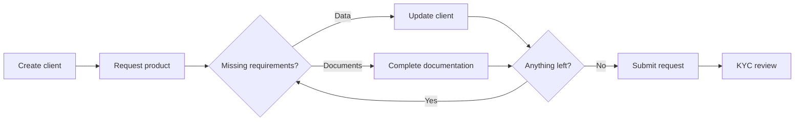

This guide walks through the full flow to onboard an individual client and enable a product for them. The model is **requirement-driven**: when you request a product, the API tells you exactly which **data** and **documents** are still missing. You fulfill those requirements, then submit the request for review.

All calls use the Management API and require an API key in the `x-api-key` header.

---

## How it works



A product enablement request moves through these states:

| Status | Meaning |
|---|---|
| `requested` | Request created. |
| `pending_documentation` | Waiting on missing data and/or documents. |
| `in_kyc` | Submitted; provider is running the compliance review. |
| `enabled` | Product is active for the client. |
| `rejected` | Request was rejected. The `rejection_description` explains why. |

<Note>
  You can inspect a client's requests and their remaining requirements at any time with [List client products](/api-reference/management/individual-clients/list-products).
</Note>

---

## Step 1 — Create the client

Create the client with at least the **required** fields: `first_name`, `last_name`, `email`, `birth_date` and `address`. Other fields (such as the phone number) are optional here but may become required later, depending on the product you request.

```bash cURL
curl -X POST "https://api.cryptomate.me/management/clients/individuals" \
  -H "x-api-key: $CRYPTOMATE_API_KEY" \
  -H "Content-Type: application/json" \
  -d '{
    "first_name": "Maria",
    "last_name": "Barber",
    "email": "mjuliabarber@example.com",
    "birth_date": "1984-11-21",
    "address": {
      "street_line1": "Florida 9860",
      "city": "Del Viso",
      "postal_code": "1669",
      "state": "ARG-B",
      "country": "ARG"
    }
  }'
```

The response includes the new client `id` — you'll use it in every following step. See [Create individual client](/api-reference/management/individual-clients/create-client) for the full field reference.

---

## Step 2 — Request the product

Request the product enablement for the client. The response comes back as `pending_documentation` and carries a `missing_requirements` object describing what's needed to enable it.

```bash cURL
curl -X POST "https://api.cryptomate.me/management/clients/individuals/{clientId}/products" \
  -H "x-api-key: $CRYPTOMATE_API_KEY" \
  -H "Content-Type: application/json" \
  -d '{
    "subproduct": "cards_individuals"
  }'
```

`missing_requirements` has two arrays — read both to know what to do next:

- **`data`** — client fields that must be present (e.g. `phone`). Fulfill these in [Step 3](#step-3-fill-in-missing-data).
- **`documents`** — documents that must be uploaded (e.g. a passport). Fulfill these in [Step 4](#step-4-upload-missing-documents).

```json missing_requirements
{
  "data": [
    { "id": "personal_information", "name": "Personal information", "required": true,
      "fields": [ { "key": "phone", "data_type": "PHONE", "required": true } ] }
  ],
  "documents": [
    { "id": "identity_document", "name": "Identity document", "required": true,
      "valid_documents": [
        { "id": "passport", "name": "Passport", "require_image": true, "require_back_image": false,
          "metadata": [ { "id": "number", "name": "Document Number", "data_type": "STRING", "required": true } ] }
      ] }
  ]
}
```

The note from the enablement request is documented in [Request product enablement](/api-reference/management/individual-clients/request-product-enablement).

---

## Step 3 — Fill in missing data

Satisfy each entry in `missing_requirements.data` with [Update individual client](/api-reference/management/individual-clients/update-client). For example, if `phone` is missing, send the phone number.

<Warning>
  Update is a full replacement: it re-validates the required fields (`first_name`, `last_name`, `email`, `birth_date`, `address`). Send the complete client payload **plus** the new fields, not just the field you're adding.
</Warning>

```bash cURL
curl -X PUT "https://api.cryptomate.me/management/clients/individuals/{clientId}" \
  -H "x-api-key: $CRYPTOMATE_API_KEY" \
  -H "Content-Type: application/json" \
  -d '{
    "first_name": "Maria",
    "last_name": "Barber",
    "email": "mjuliabarber@example.com",
    "birth_date": "1984-11-21",
    "address": {
      "street_line1": "Florida 9860",
      "city": "Del Viso",
      "postal_code": "1669",
      "state": "ARG-B",
      "country": "ARG"
    },
    "phone_country_code": 54,
    "phone_number": 1168860622
  }'
```

---

## Step 4 — Upload missing documents

Satisfy each entry in `missing_requirements.documents` with [Complete product documentation](/api-reference/management/individual-clients/complete-product-documentation). This endpoint takes **one document per call** — if several documents are missing, call it once for each.

Use the `document_type` listed under the requirement's `valid_documents`, attach the base64-encoded image(s), and include any required `metadata` fields.

<Warning>
  **Identification documents must be a photo or scan of the physical document.** For any identity document — such as `passport`, `national_id`, `drivers_license` or `ssn` — upload an image of the actual physical document. Digital-only versions issued by government apps are **not accepted** and will fail the KYC review, including for example Argentina's **Mi Argentina**, Colombia's **Cédula Digital**, Brazil's **Carteira Digital de Trânsito**, Mexico's **Licencia Digital CDMX**, and Europe's **EU Digital Identity Wallet** / **France Identité** / Spain's **MiDNI**, or any similar national digital-ID app. Make sure the whole document is visible, in focus and well lit, and include the back image (`image_back`) whenever the document type requires it.
</Warning>

```bash cURL
curl -X POST "https://api.cryptomate.me/management/clients/individuals/{clientId}/products/{productRequestId}/documentation" \
  -H "x-api-key: $CRYPTOMATE_API_KEY" \
  -H "Content-Type: application/json" \
  -d '{
    "document": {
      "document_type": "passport",
      "image_front": "data:image/jpeg;base64,/9j/4AAQSkZJRgABAQ...",
      "metadata": {
        "number": "AB1234567",
        "issuing_country": "ARG"
      }
    }
  }'
```

The response returns the updated `missing_requirements` and a `rejected_items` array. If a document is rejected, fix the issue noted in its `reason` and upload it again.

<Tip>
  After Steps 3 and 4, re-check `missing_requirements` (in the response or via [List client products](/api-reference/management/individual-clients/list-products)). Repeat until both `data` and `documents` are empty.
</Tip>

---

## Step 5 — Submit the request

Once nothing is left missing, submit the request. This re-evaluates it and, when complete, advances it to `in_kyc` and notifies the provider to start the compliance review.

```bash cURL
curl -X POST "https://api.cryptomate.me/management/clients/individuals/{clientId}/products/{productRequestId}/submit" \
  -H "x-api-key: $CRYPTOMATE_API_KEY"
```

If requirements are still pending, the response reports them instead of advancing — go back to Step 3 or 4 and resolve them first. See [Submit product enablement request](/api-reference/management/individual-clients/submit-product).

---

## Next steps

<Card
  title="Individual Clients API"
  icon="terminal"
  href="/api-reference/management/individual-clients/create-client"
  horizontal
>
  Full request and response reference for every endpoint used in this guide.
</Card>
