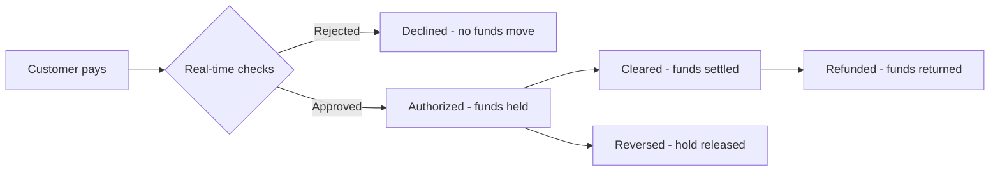

Individual cards let you assign a virtual Visa card directly to each of your end customers. Unlike the standard company-level card model — where all cards belong to your company — in this model each card is tied to a specific customer who goes through their own identity verification process.

Before a card can be issued to a customer, **that customer must exist and be active in CryptoMate**.

---

## How it works

The process has three stages:

1. **Register the customer** with the individual cards option enabled
2. **Complete their information and documentation** so they can pass the compliance review
3. **Issue the card** once the customer is active

---

## Step 1 — Create the customer

When creating a customer, make sure to enable the **Individual cards** option. This checkbox activates the individual card program and reveals the additional fields the provider requires for verification.

In addition to basic contact details, you will need to provide the following information about the customer:

- **Personal details** — full name, date of birth, gender, and residential address
- **Official ID** — type and number of the customer's identity document (for example, passport or national ID)
- **Financial information** — occupation, annual salary range, account purpose, and expected monthly usage volume

<Warning>
The financial fields (occupation, salary, purpose, and expected volume) are mandatory when the individual cards option is enabled. The registration cannot be completed without them.
</Warning>

---

## Step 2 — Upload the required documentation

Once the customer is created, the system will indicate which documents are needed to complete the compliance review. The following are typically requested:

- Valid government-issued ID (front and back)
- Passport
- Proof of address

Upload the document images directly in the portal. Make sure the images are legible and current — blurry or expired documents will be rejected and will delay the process.

---

## Step 3 — Review and customer activation

After uploading the documentation, the customer enters **Pending** status while the compliance team validates the information. This process is automatic in most cases.

| Status | Meaning |
|---|---|
| **Pending** | Customer created; review in progress. |
| **Active** | Review approved. A card can now be issued. |
| **Rejected** | Documentation did not pass the review. Correct and resubmit the flagged documents. |

If a customer is **Rejected**, the system will show the rejection reason for each document. Address the issues noted, reupload the documentation, and the review will restart.

<Tip>
Validation usually completes within minutes. If the customer remains Pending after several hours, contact the CryptoMate support team.
</Tip>

---

## Step 4 — Issue the card

With the customer in **Active** status, you can issue their card. The card will be linked to that customer and ready to use.

<Note>
A card cannot be issued to a customer who is still Pending or Rejected.
</Note>

### How many cards each customer can have

Each customer can hold up to **5 cards** at the same time.

Every card that has not been cancelled counts toward that limit, whatever its status — active, inactive, frozen, expired, or blocked. **Cancelling a card is the only way to free a slot.** Attempting to issue a sixth card is rejected and nothing is created, neither in CryptoMate nor with the card issuer.

<Warning>
This limit is per customer and is separate from your company's contracted card quota. The two are checked independently: a customer below their own limit can still be blocked because the company ran out of contracted units, and vice versa. The error message tells you which limit was hit.
</Warning>

### Updating the customer's data

The customer's name, email and phone can be updated from any of their cards, through the [Update individual card holder](/api-reference/cards/individual-cards/update-individual-card-holder) endpoint or from the card detail in the Portal.

<Warning>
There is no per-card copy of this data. It belongs to the customer, so updating it from one card changes it for the customer and therefore for **every other card they hold**.
</Warning>

The card issuer is updated first: if it rejects the change, nothing is saved and the two copies never diverge. The address, birth date and identity document are captured during identity verification and are fixed at the issuer — they cannot be changed afterwards.

---

## Summary

<Steps>

<Step title="Create the customer">
  Register the customer with the **Individual cards** option enabled and complete all their personal and financial details.
</Step>

<Step title="Upload documentation">
  Submit the requested identity documents. Make sure they are legible and current.
</Step>

<Step title="Wait for activation">
  The customer moves from **Pending** to **Active** once the compliance review is approved.
</Step>

<Step title="Issue the card">
  With the customer active, issue their individual card from the portal.
</Step>

</Steps>

---

## Purchase lifecycle

A purchase is not a single event. It starts as an **authorization** — money reserved on the program balance — and finishes when the card network **settles** it, which normally happens days later, can arrive in several pieces, and occasionally never arrives at all.

### Where the money comes from

The individual cards program has its **own holding wallet** and its **own fees wallet**, funded and withdrawn separately from any other card program you run. Every card your customers hold spends that single holding balance. Cards created with the top-up approval method also get their own deposit wallet, so an individual customer can be funded on their own.

### Stage 1 — Authorization

The network asks CryptoMate to approve the purchase and expects an answer within about a second. The purchase is declined when:

- The card is blocked or deleted.
- It breaks one of the account's velocity rules.
- It exceeds the card's daily, weekly, monthly or per-transaction limit.
- The program holding balance does not cover it.
- The risk score engine rejects it as fraudulent.
- On cards using the webhook approval method, your own systems decline it or fail to answer in time.

Every check is applied to the **total cost of the purchase**, fees included. A purchase that fits the merchant's price but not the price with fees is declined.

A declined purchase moves no money and reaches your systems as a `declined` event carrying the reason.

### Stage 2 — Hold

An approved purchase is reserved right away, long before the merchant is paid:

| Balance | Effect at authorization |
|---|---|
| Customer's card deposit wallet (top-up cards only) | Debited by the purchase plus fees |
| Program holding wallet | Debited by the purchase plus fees |
| Program fees wallet | Credited with your commission on the purchase |

Your systems receive an `authorized` event. From here the money is no longer spendable, but it has not left the program either.

<Warning>
A hold is not a payment. Until the purchase settles or is released, the reserved amount is unavailable for other purchases — on that card and on every other card in the program, because they all draw on the same holding balance.
</Warning>

### Stage 3 — Settlement

Once the merchant submits the purchase for payment, the network settles it and CryptoMate emits a `cleared` event.

The settled amount is frequently **not** the amount that was authorized: tips added after the fact, incremental captures and exchange-rate re-rating on multi-day settlements all change it. CryptoMate compares what was held against what was settled, recalculates the fees on the settled amount, and adjusts the balance **once**, when the purchase closes. A purchase can settle in several pieces, and each piece emits its own `cleared` event — while the purchase is still partially settled the remaining hold keeps covering what is left, so reconcile on the purchase, not on the event.

### Stage 4 — Releases and returns

Not every purchase ends at settlement:

| Outcome | What it means |
|---|---|
| `reversal` | The merchant or the network released the hold, fully or partially. The released amount is credited back. |
| `refund` | The merchant returned money after settlement. It arrives as its own credit, not as a change to the original purchase. |
| `declined` after an `authorized` | The network cancelled an authorization it had already approved. It is processed as a reversal, so the held funds are credited back. |

<Warning>
If a settlement never arrives, the hold is **not** released automatically. Contact CryptoMate support to have the purchase reviewed and the funds freed.
</Warning>

### Program limitations

Two parts of the purchase flow are not available for individual cards yet:

- **3DS challenges.** A purchase that triggers a cardholder challenge does not complete.
- **Disputes.** Dispute events are not processed, so a dispute outcome is never credited automatically.

<Note>
When a velocity rule trips, the card is **frozen** — and on top-up cards its deposit wallet is disabled too. Unfreeze it to let the customer transact again.
</Note>

Purchase events for this program are delivered with the `individual_cards` product. The event names are shared with other card programs, so route on the product first: a `cleared` event for an individual card looks like any other apart from that field.
